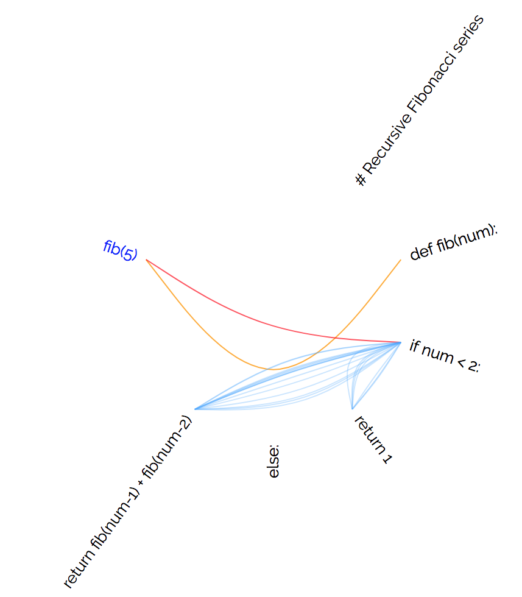

# flow
Python Control Flow Visualiser

<table>
    <tr>
        <td>Turn this</td>
        <td>into this!</td>
    </tr>
    <tr>
        <td>
<pre>
# Recursive Fibonacci series
def fib(num):
    if num < 2:
        return 1
    else:
        return fib(num-1) + fib(num-2)

fib(5)
</pre>
        </td>
        <td>
            
        </td>
    </tr>
</table>

## :octocat: how do I develop locally?
Install the dependencies (`flask`) and then run using `python app.py`

## :octocat: author
Sayan Goswami (2018)